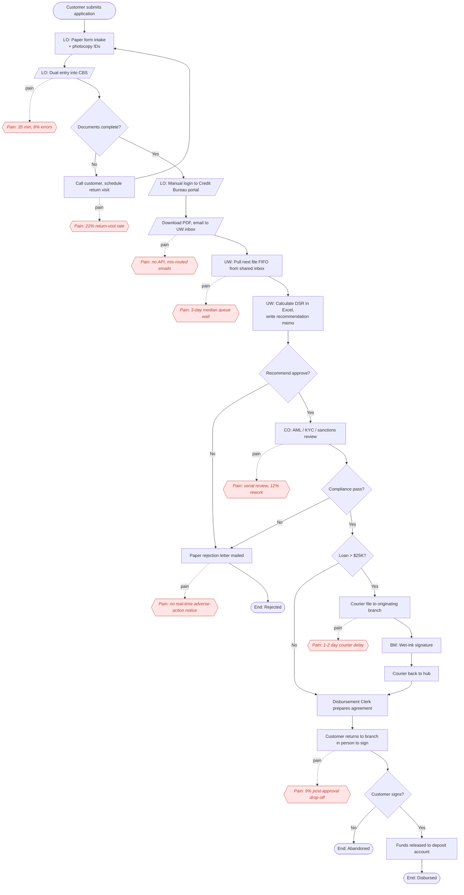
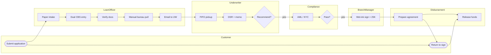

# As-Is BPMN — Loan Approval (Current State)

Mermaid BPMN-style swimlane diagram. Pain-point steps are highlighted in red.

## Swimlane View (Roles)

**Legend**
- Red italic notes = identified pain points (cross-referenced in [gap analysis](../docs/02-gap-analysis.md)).
- `[/.../]` shapes denote manual / non-automated activities.
