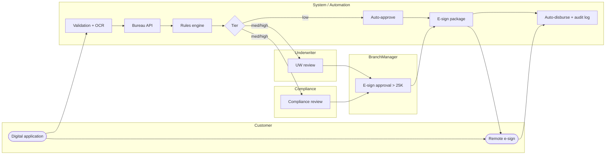

# To-Be BPMN — Loan Approval (Redesigned)

Redesigned flow introducing: digital intake, **automated credit scoring API**, **parallel Underwriting + Compliance**, tiered approval, and **digital signature** for disbursement. Automated / system activities are highlighted in green.

```mermaid
flowchart TD
    Start([Customer: digital application via web/mobile]) --> SYS1[/System: real-time field validation & doc checklist/]
    SYS1 --> SYS2[/System: OCR & extract ID + pay stub data/]
    SYS2 --> SYS3{Documents complete?}
    SYS3 -- No --> SYS4[Auto-notify customer: missing item via SMS/email]
    SYS4 --> SYS3
    SYS3 -- Yes --> API1[/API: Credit Bureau pull JSON/]
    API1 --> RULES[/Rules engine: standardized DSR & risk score/]
    RULES --> TIER{Risk tier?}

    TIER -- Low risk &lt;= 15K --> AUTO1[/System: auto-approve per policy/]
    AUTO1 --> ESIGN

    TIER -- Medium / High --> PARALLEL
    subgraph PARALLEL [Parallel review &#40;Gateway: AND-split&#41;]
        direction LR
        UW1[UW: Review case in workflow tool] --> UWD{UW decision}
        CO1[CO: AML/KYC/sanctions in workflow tool] --> COD{CO decision}
    end
    UWD --> JOIN((AND-join))
    COD --> JOIN
    JOIN --> DECIDE{Both approve?}
    DECIDE -- No --> REJ1[/System: real-time adverse-action notice in portal + email/]
    REJ1 --> EndR([End: Rejected with reasons])
    DECIDE -- Yes --> AMT{Loan &gt; 25K?}
    AMT -- No --> ESIGN
    AMT -- Yes --> BM1[BM: e-sign approval in workflow tool]
    BM1 --> ESIGN[/System: send e-sign package to customer/]
    ESIGN --> CUST1[Customer: remote ID verification + e-sign]
    CUST1 --> SIGNED{Signed within SLA?}
    SIGNED -- No --> REMIND[/Auto-remind at 24h, 72h/]
    REMIND --> SIGNED
    SIGNED -- Yes --> DISB[/System: auto-disburse to deposit account/]
    DISB --> AUDIT[/System: write immutable audit trail/]
    AUDIT --> EndA([End: Disbursed])

    classDef auto fill:#e6f9ec,stroke:#1e8449,color:#1e8449
    class SYS1,SYS2,SYS4,API1,RULES,AUTO1,REJ1,ESIGN,DISB,AUDIT,REMIND auto
```

## Swimlane View

## Key Changes vs As-Is

| Change | Gap(s) Addressed | BPMN Element |
|---|---|---|
| Digital intake + field validation | GAP-01, GAP-02 | `SYS1` real-time validation task |
| OCR-driven document capture | GAP-01 | `SYS2` automated task |
| Credit Bureau API call | GAP-03 | `API1` service task |
| Standardized rules engine | GAP-05 | `RULES` business rule task |
| Tiered auto-approval | GAP-08 | `TIER` exclusive gateway + `AUTO1` |
| Parallel UW + Compliance | GAP-06 | AND-split / AND-join gateways |
| E-signature for BM | GAP-07 | `BM1` user task with e-sign |
| Remote customer e-sign | GAP-09 | `ESIGN` + `CUST1` |
| Real-time adverse-action notice | GAP-10 | `REJ1` automated send task |
| Customer portal status | GAP-11 | Covered by digital intake + reminders |
| Immutable audit trail | GAP-12 | `AUDIT` automated task |

## Expected Outcomes

| Metric | As-Is | To-Be Target |
|---|---|---|
| Median time-to-decision | 7 days | < 4 hours |
| Median time-to-disbursement | 9–12 days | < 2 business days |
| Manual rework rate | 18% | < 5% |
| Post-approval drop-off | 9% | < 2% |
| Compliance-stage late rejection | 12% | < 3% (caught in parallel) |
